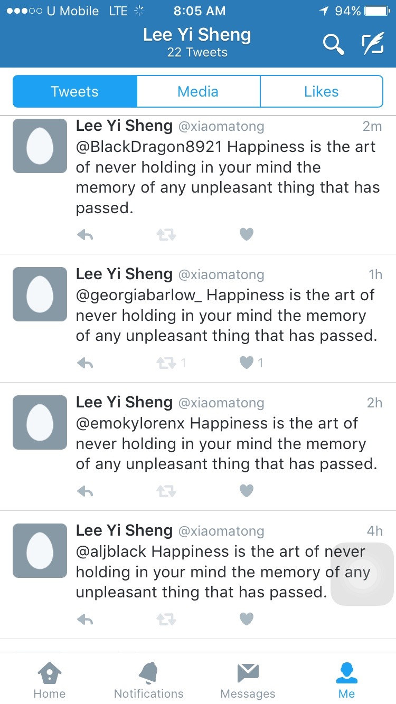
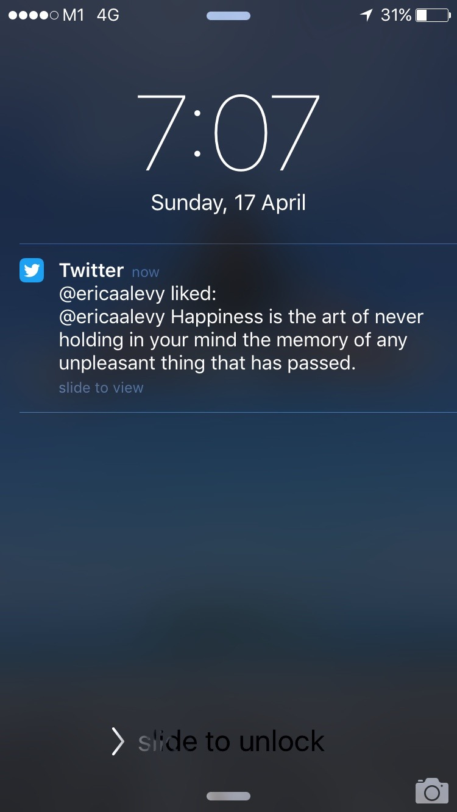
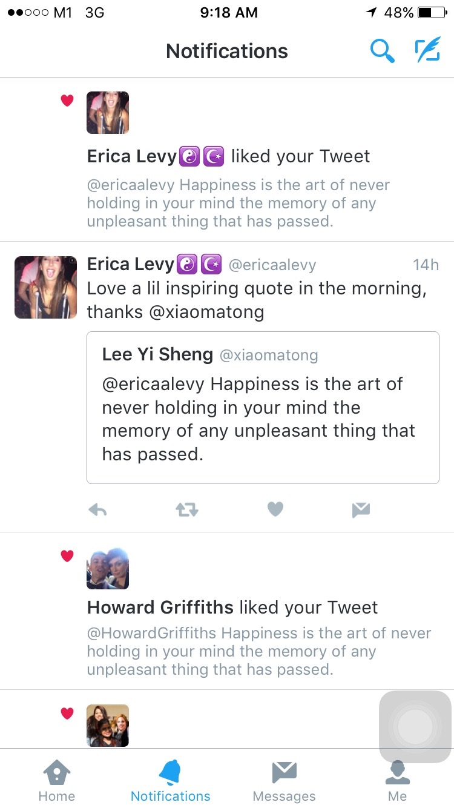

# Overview

This ruby app looks for a tweet with hashtag #sad every hour and responds to it with a positive quote via @xiaomatong.

###Notes
* "Twitter" gem is employed in this application.
* A Class  named "twitterbot" is created to host the methods uses in this app.
* A rake file named "update_tweet" is created to call the methods.
* Heroku Scheduler is employed to run the rake task hourly.
  
###Cool response from fellow Twitter users 

